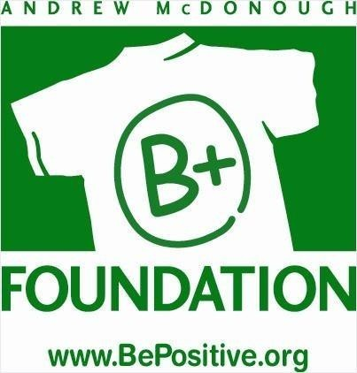
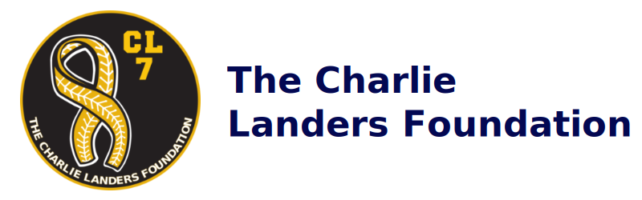

---
# Feel free to add content and custom Front Matter to this file.
# To modify the layout, see https://jekyllrb.com/docs/themes/#overriding-theme-defaults

layout: page
title: Home
# page_title intentionally omitted — the hero below carries the title.
---

<link rel="preconnect" href="https://fonts.googleapis.com">
<link rel="preconnect" href="https://fonts.gstatic.com" crossorigin>
<link href="https://fonts.googleapis.com/css2?family=Inter:wght@400;500;600;700;800&family=Lora:ital,wght@0,500;0,600;1,500&display=swap" rel="stylesheet">

<!-- ============ TWO-COLUMN BODY ============ -->

  <!-- LEFT: Hero slideshow + Who we are -->
  

    <!-- HERO SLIDESHOW (column width) -->
    

      

        <!-- SLIDES:START — auto-listed from /pics/slideshow/. Just drop images in that folder. -->
        
        
        
        <!-- SLIDES:END -->

        

          Cancer Epigenomics
          <h1 class="hero-title">Welcome to the Gao Lab @ Case Western Reserve University</h1>
          

        

        <button class="nav-arrow nav-prev" onclick="changeSlide(-1)" aria-label="Previous slide">&#10094;</button>
        <button class="nav-arrow nav-next" onclick="changeSlide(1)" aria-label="Next slide">&#10095;</button>

        

      

    

    About the Lab
    <h2 class="section-title">Who We Are</h2>
    

    We are a cancer epigenomics lab based in the <a href="https://case.edu/medicine/pharmacology/">Department of Pharmacology</a> at Case Western Reserve University, School of Medicine. Our research is dedicated to uncovering novel fundamental mechanisms underlying gene expression in cancers. We utilize advanced multi-omics technologies, including high-throughput CRISPR screening, single-cell transcriptomics, epigenomics, proteomics, and metabolomics to comprehensively detail the oncogenic mechanisms of transcription factors and identify therapeutic targets for treatment.
    

    

      <strong>We are currently seeking postdocs, students, and staff to join our team.</strong> For more information, please view our available <a href="https://ygaoyg.github.io/join/">opportunities</a>.
    

  

  <!-- RIGHT: News -->
  <aside class="home-aside reveal d2">
    Updates
    <h2 class="section-title">Lab News</h2>
    

      <!-- Add more 
…
 blocks below (newest first).
           They auto-group into pages of two. -->
      

        <!-- NEWS:START — auto-generated from _data/news.yml (newest first) -->
        
        
        

          {{ item.date_display }}
          {{ item.text }}
        

        
        <!-- NEWS:END -->
      

    

    

    <a class="news-more" href="https://ygaoyg.github.io/news/">More news</a>
  </aside>

<!-- ============ FUNDING ============ -->

  Support
  <h2 class="section-title">Funding &amp; Support</h2>
  

    

    

    

    

    

  

<!-- /.home -->

<!-- ============ SLIDESHOW SCRIPT ============ -->

