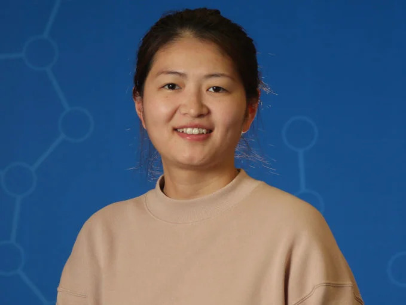
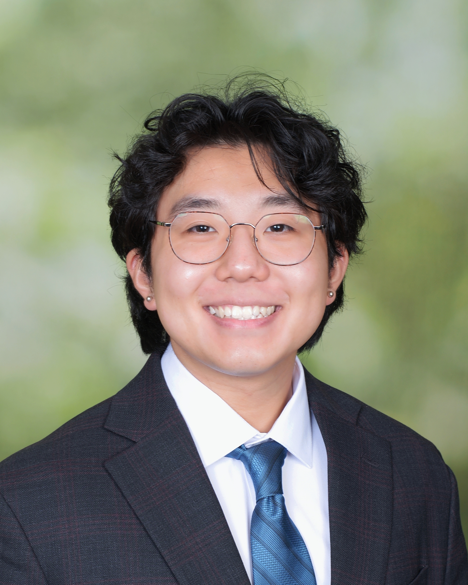
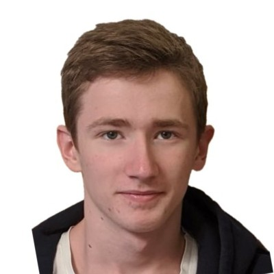

## PI
<h4><strong>Yuan Gao, PhD</strong></h4>

  

    
  

  

    
Dr. Yuan Gao earned her Ph.D. in Biochemistry and Molecular Biology from Mayo Clinic College of Medicine. She worked as a Postdoctoral Fellow in Dr. Christopher Vakoc's lab at Cold Spring Harbor Laboratory and, starting in 2024, established her own lab as an Assistant Professor in the Department of Pharmacology at Case Western Reserve University. Dr. Gao's research focuses on epigenetic dysregulation and drug target discovery in cancer, earning recognition such as the NIH K99/R00 Pathway to Independence Award and the CSHL Simons Cancer Research Fund. Her work has been published in journals including Nature Cell Biology, PNAS, Nucleic Acid Research, Cancer Cell, and Nature Genetics.
  

**Email**: yxg811 [at] case [dot] edu

## Research Assistants

  

    
  

  

    <h4><strong>Alvin Liu</strong></h4>
    
Alvin is a research assistant in the lab who graduated from Case Western Reserve University in 2024 with a B.A. in Cognitive Science.

  

  

    
  

  

    <h4><strong>Anton Sergeev</strong></h4>
    
Anton is a research assistant in the lab. He obtained his bachelor’s degree from Boston University in 2024.

  

***
<!---
## Alumni

| Name | Role | Current status |
| ----------- | ----------- | -----------
|  |  |  ||
-->
