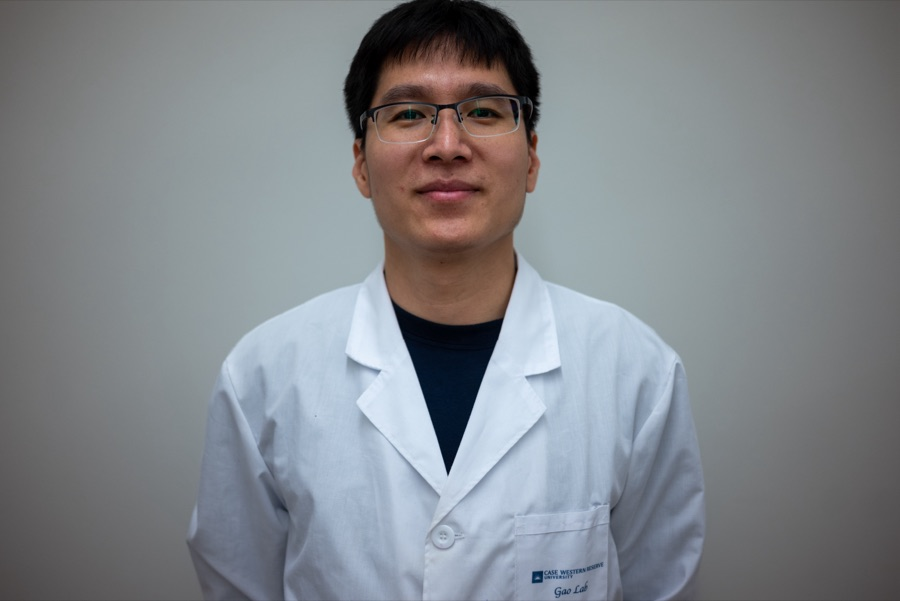
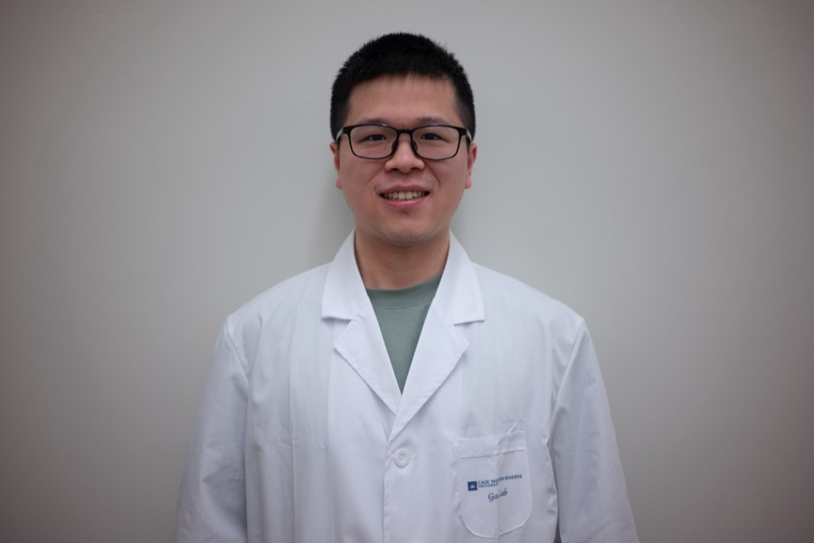
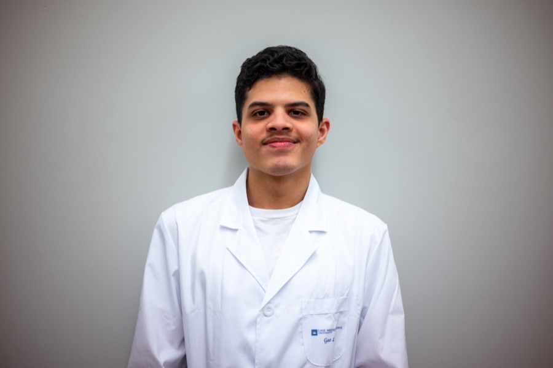
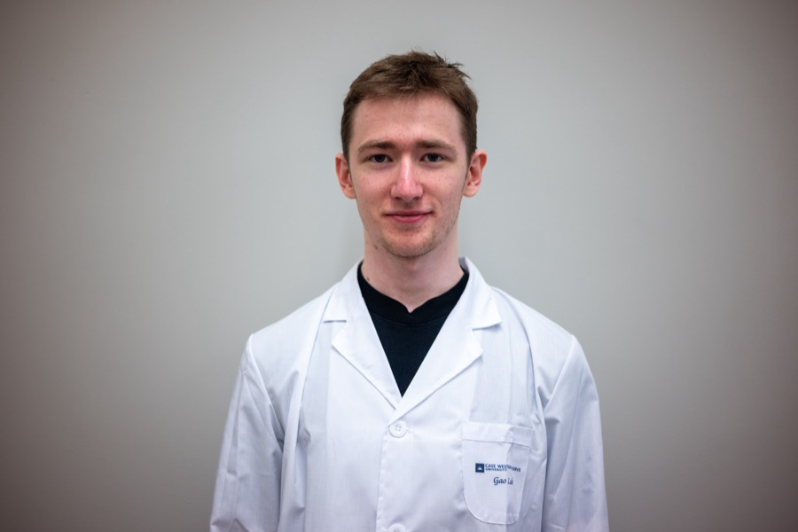

<link rel="preconnect" href="https://fonts.googleapis.com">
<link rel="preconnect" href="https://fonts.gstatic.com" crossorigin>
<link href="https://fonts.googleapis.com/css2?family=Inter:wght@400;500;600;700&family=Lora:wght@500;600&display=swap" rel="stylesheet">

<h2 class="group-section">Principal Investigator</h2>

  
  

    
Yuan Gao, PhD

    
Assistant Professor

    
Dr. Yuan Gao is an Assistant Professor in the Department of Pharmacology at Case Western Reserve University, School of Medicine, where she established her lab in 2024. She earned her Ph.D. in Biochemistry and Molecular Biology from Mayo Clinic College of Medicine and completed her postdoctoral training in Dr. Christopher Vakoc's lab at Cold Spring Harbor Laboratory.

  

<h2 class="group-section">Postdoctoral Fellows</h2>

  
  

    
Hang Zhao, PhD

    
Postdoctoral Fellow

    
Dr. Hang Zhao earned a Ph.D. in Biochemistry and Molecular Biology from the School of Life Sciences at Peking University, advised by Dr. Qing Li, after completing a B.Sc. in Biological Science at Xiamen University under Dr. Jiahuai Han. Hang joined the Gao Lab as a postdoctoral fellow.

  

<h2 class="group-section">Graduate Students</h2>

  
  

    
Muyi (Felix) Ye

    
Graduate Student

    
Muyi (Felix) Ye is a graduate student in the Department of Pharmacology. He earned his Bachelor's degree in Biochemistry from Case Western Reserve University in 2024.

  

  
  

    
Yeriel Avellanet-Crespo

    
Graduate Student

    
Yeriel is a graduate student in the Department of Genetics and Genome Sciences. He earned his Bachelor's degree in Chemistry and Molecular Cell Biology from the University of Puerto Rico in 2024.

  

<h2 class="group-section">Research Assistants</h2>

  
  

    
Anton Sergeev

    
Research Assistant

    
Anton works as a research assistant in the lab. He obtained his bachelor's degree from Boston University in 2024.

  

<h2 class="group-section">Alumni</h2>

<table class="alumni-table">
  <thead>
    <tr><th>Name</th><th>Role</th></tr>
  </thead>
  <tbody>
    <tr><td>Alvin Liu</td><td>Research Assistant</td></tr>
    <tr><td>Saanvi Srivastava</td><td>Undergraduate Research Assistant</td></tr>
    <tr><td>Joy Fei</td><td>Undergraduate Research Assistant</td></tr>
  </tbody>
</table>

