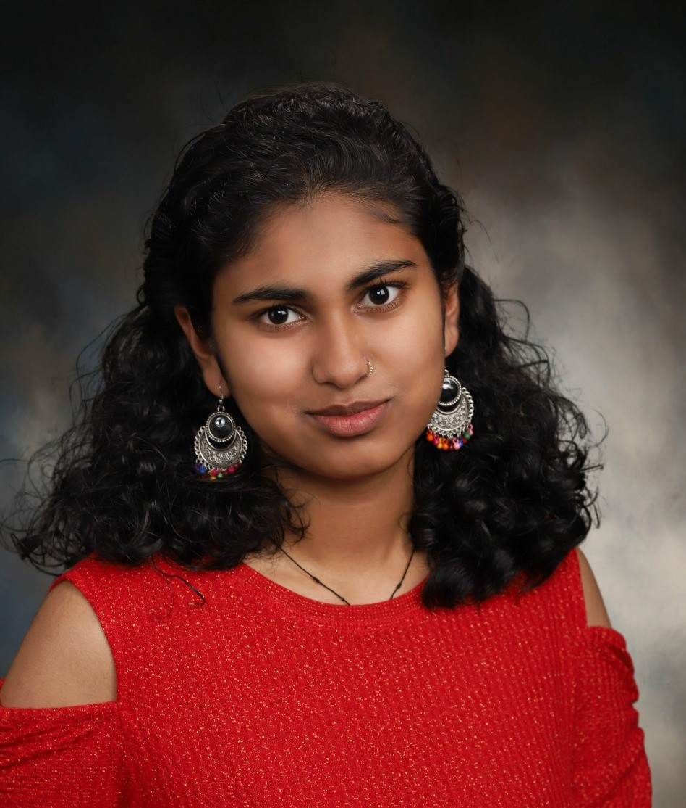

## PI

  

    
  

  

    <h4><strong>Yuan Gao, PhD</strong></h4>
    
Dr. Yuan Gao earned her Ph.D. in Biochemistry and Molecular Biology from Mayo Clinic College of Medicine. She then worked as a Postdoctoral Fellow in Dr. Christopher Vakoc's lab at Cold Spring Harbor Laboratory and, starting in 2024, established her own lab as an Assistant Professor in the Department of Pharmacology at Case Western Reserve University.
    

  

## Research Assistants

  

    
  

  

    <h4><strong>Alvin Liu</strong></h4>
    
Alvin is a research assistant in the lab who graduated from Case Western Reserve University in 2024 with a B.A. in Cognitive Science.

  

  

    
  

  

    <h4><strong>Anton Sergeev</strong></h4>
    
Anton works as a research assistant in the lab. He obtained his bachelor’s degree from the Boston University in 2024.

  

## Undergraduate Research Assistant

  

    
  

  

    <h4><strong>Saanvi Srivastava</strong></h4>
    
Saanvi is a current sophomore at the Case Western Reserve University pursuing a major in biochemistry.

  

***
<!---
## Alumni

| Name | Role | Current status |
| ----------- | ----------- | -----------
|  |  |  ||
-->
